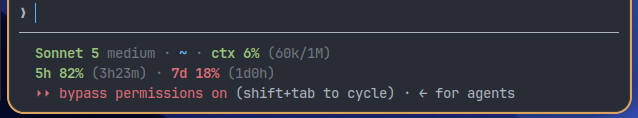

# claude-statusline

An ultra-fast, zero-overhead custom statusline binary for [Claude Code](https://docs.anthropic.com/en/docs/agents-and-tools/claude-code), written in Rust.



## Highlights

- **Sub-Millisecond Execution (~0.5 ms):** Eliminates CPU spikes and terminal lag by replacing heavy shell scripts and multiple `jq`/`git`/`date` subprocesses with a native compiled binary.
- **Terminal Native Colors:** Uses standard 16-color ANSI escapes rather than hardcoded 24-bit RGB values, automatically matching your terminal's active color scheme and theme.
- **In-Process Git Resolution:** Detects the current Git branch and detached HEAD states directly in-process from `.git/HEAD` without spawning external `git` commands.
- **Smart Path Shortening:** Intelligently collapses deep directories into clean breadcrumbs (e.g. `…/repo/subproject`) while preserving home shortcuts (`~`).
- **Session-Safe Rate Limit Sync:** Synchronizes 5-hour and 7-day rate-limit budgets via file-locking (`flock`), preventing idle or stale sessions from overwriting fresh rate-limit telemetry.
- **Waybar Widget Integration:** Atomically updates `~/.cache/claude/ratelimits.json` on every render for seamless desktop bar status modules.

## Benchmarks

Measured on Linux (x86_64, 50 iterations):

| Implementation | Mean Latency | Min | Max | Subprocesses |
|---|---|---|---|---|
| Bash + jq script | 24.70 ms | 11.29 ms | 97.27 ms | 6-8 per render |
| **Rust binary** | **0.50 ms** | **0.43 ms** | **1.02 ms** | **0 (native)** |

**Result:** ~50x faster execution and zero subprocess forks per render tick.

## Installation

### Via AI Agent

Give this prompt to Claude Code (or any coding agent with shell access) and it'll clone, build, install, and wire up `settings.json` for you:

```
Install yesvus/claude-statusline: clone https://github.com/yesvus/claude-statusline,
build it from source with cargo (no prebuilt release binaries exist yet), install the
resulting binary to ~/.local/bin/claude-statusline, then update the statusLine block in
~/.claude/settings.json to point at it with "padding": 0.
```

### From Source

Ensure you have Rust installed (`curl --proto '=https' --tlsv1.2 -sSf https://sh.rustup.rs | sh`):

```bash
git clone https://github.com/yesvus/claude-statusline.git
cd claude-statusline
cargo build --release
cp target/release/claude-statusline ~/.local/bin/
```

Or install directly with cargo:

```bash
cargo install --path .
```

## Configuration

Add or update the `statusLine` configuration in your `~/.claude/settings.json`:

```json
{
  "statusLine": {
    "type": "command",
    "command": "/home/yesvus/.local/bin/claude-statusline",
    "padding": 0
  }
}
```

*(Alternatively, you can keep a shell wrapper script with `exec ~/.local/bin/claude-statusline "$@"`).*

## How It Works

1. Claude Code pipes session metrics JSON to `claude-statusline` on standard input (`stdin`).
2. `claude-statusline` extracts:
   - **Row 1:** Active model, effort level, shortened workspace path, and active Git branch.
   - **Row 2:** 5-hour and 7-day rate limits with countdown timers until reset, followed by context window utilization (`used_percentage` and token ratio).
3. Rate limits are synchronized to `~/.cache/claude/ratelimits.json` with thread/process-safe locking so external status bars (such as Waybar) always reflect accurate budgets.

## Versioning

This project follows [Semantic Versioning](https://semver.org/). Releases are tagged as `vX.Y.Z` and published on the [Releases](https://github.com/yesvus/claude-statusline/releases) page with prebuilt binaries. See [CHANGELOG.md](CHANGELOG.md) for a history of changes.

## License

MIT © [yesvus](https://github.com/yesvus)
